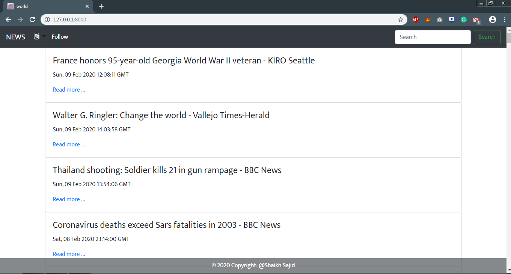
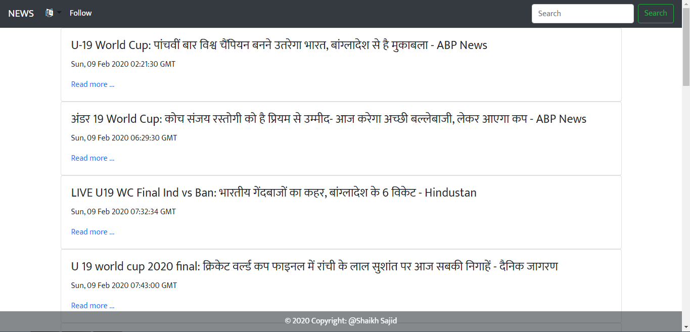
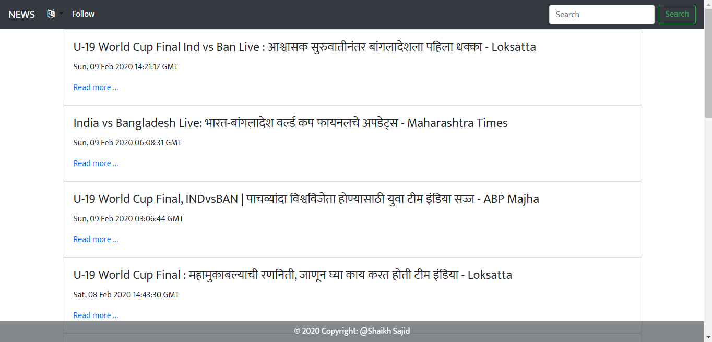
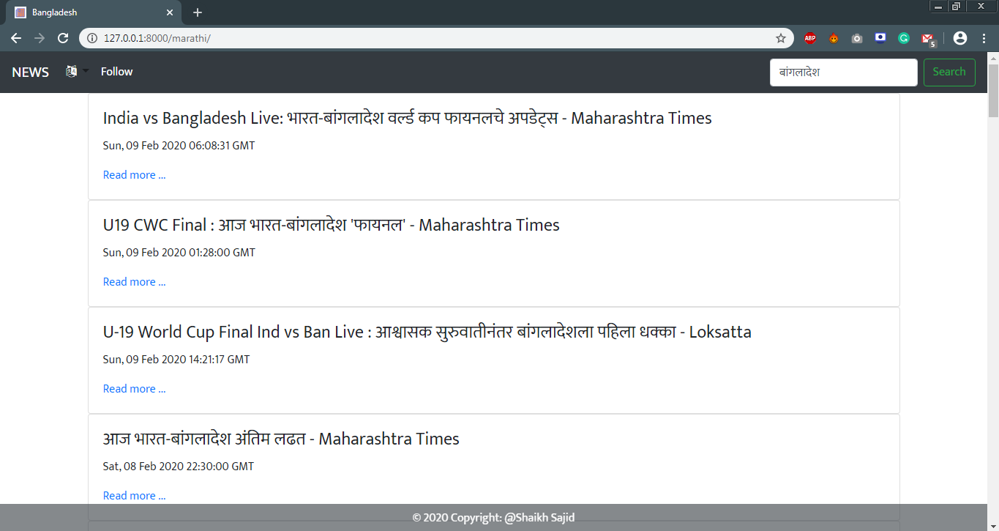

# NEWS APP
News App Using Django

# About
> This is a news web app, fetches all the latest news headlines, and shows output as a list of news and provides link for the same headline.

# Features
- Gets you latest news

- It supports multiple languages which includes hindi and marathi apart from english

- It gives you option to search quickly and go through your favuorite topic easily
- It support multiple languages for search, that means even if you enter portuguese keyword in search bar, it would give you result in translation

# Technologies

This News app uses a number of framework,library to work properly:

*  [Twitter Bootstrap 4.4.1](https://getbootstrap.com/) - Provides responsive UI for modern web apps
*  [Jquery 3.4.1](https://jquery.com/) - Again for UI
*  [Django 3.0.2](https://www.djangoproject.com/) - For the Backend
*  [googletrans 2.4.0](https://pypi.org/project/googletrans/) - For proper translation of keywords
*  [Font Awesome 4.7.0](https://fontawesome.com/) - For Icons in UI
*  [beautifulsoup 4.8.2](https://pypi.org/project/beautifulsoup4) - For scraping data from web
*  [lxml 4.5.0](https://pypi.org/project/lxml)
*  [Python 3.7](https://www.python.org/)

# License
 
 Apache License 2.0

